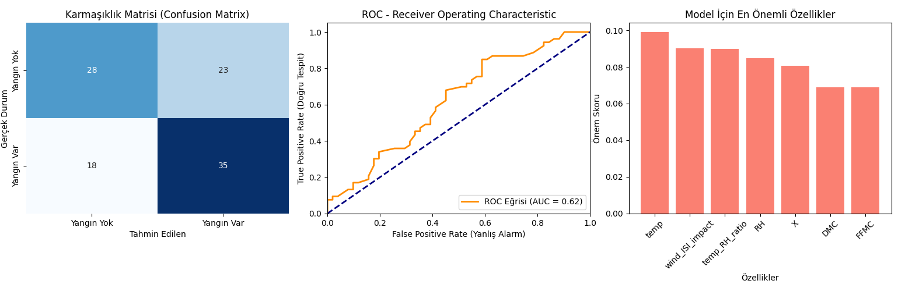

# Forest Fire Analysis with Machine Learning 🌳🔥

Machine learning-based forest fire analysis project developed using the UCI Machine Learning Repository Forest Fires dataset.

## 📌 Project Description

This project analyzes forest fire behavior using meteorological and environmental variables and applies machine learning algorithms to:

* predict whether a fire will occur (**classification**)
* estimate burned area severity (**regression**)

The project includes full data preprocessing, feature engineering, exploratory data analysis, model comparison, and performance evaluation.

## 👥 Team Members

* Yunus Emre Sekmen
* Eren Balkış
* Yusuf Diler
* Ramazan Özgüğr Altuğ

## 📂 Dataset

Dataset source: [Forest Fires Data Set](https://archive.ics.uci.edu/dataset/162/forest+fires)

Original dataset contains:

* Spatial coordinates (X, Y)
* Month / Day
* FFMC
* DMC
* DC
* ISI
* Temperature
* Relative Humidity
* Wind
* Rain
* Burned Area

Dataset collected from natural park regions in Portugal.

## 🔍 Exploratory Data Analysis (EDA)

Performed analysis includes:

* burned area distribution analysis
* log transformation of skewed target variable
* correlation heatmap
* scatter plots for:

  * temperature vs burned area
  * humidity vs burned area
  * wind vs burned area
* boxplots
* regression plots

## ⚙️ Feature Engineering

Additional features created:

* `log_area` → log transformed burned area
* `temp_RH_ratio` → temperature / humidity ratio
* `drought_index` → DMC + DC
* `wind_ISI_impact` → wind × ISI
* `high_temp_risk` → binary risk above 30°C
* `is_summer` → August / September indicator

Also applied:

* One-Hot Encoding for month and day variables

## 🤖 Machine Learning Models

### Classification Models

Used for predicting fire occurrence:

* Logistic Regression
* Support Vector Machine (SVC)
* K-Nearest Neighbors (KNN)
* Random Forest Classifier
* Gradient Boosting Classifier

### Regression Models

Used for burned area prediction:

* Linear Regression
* Random Forest Regressor
* SVR
* XGBoost Regressor

## 🧪 Model Optimization

Hyperparameter tuning performed with:

* GridSearchCV
* 5-fold Cross Validation

## 📈 Evaluation Metrics

### Classification

* Accuracy
* Classification Report
* Confusion Matrix
* ROC Curve

### Regression

* MAE
* RMSE
* R² Score

## 🏆 Results

### Classification

Best classification model:

* Random Forest
* Accuracy ≈ 60%

### Regression

Best regression model:

* XGBoost Regressor

Important predictors:

* temperature
* wind
* humidity
* FFMC
* DMC

## 📊 Model Evaluation Results



This figure presents:
- Confusion Matrix
- ROC Curve
- Feature Importance Analysis

## 🛠️ Technologies Used

* Python
* Pandas
* NumPy
* Matplotlib
* Seaborn
* Scikit-learn
* XGBoost

## 📁 Project Structure

```
forest-fire-analysis/
│──plots/
│ │──visual.png
│── forestfires.csv
│── forestfires_processed.csv
│── mlproje.py
│── README.md
```

## 🚀 Run Project

```
git clone <repo-link>
cd forest-fire-analysis
pip install pandas numpy matplotlib seaborn scikit-learn xgboost
python mlproje.py
```

## 📌 Future Improvements

* class imbalance handling
* deep learning models
* wildfire risk dashboard
* geospatial integration

## 📄 License

Academic project for educational purposes.
